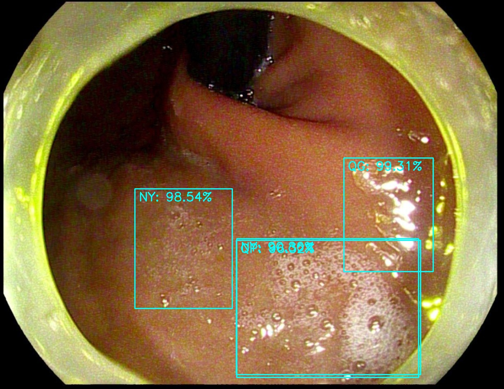
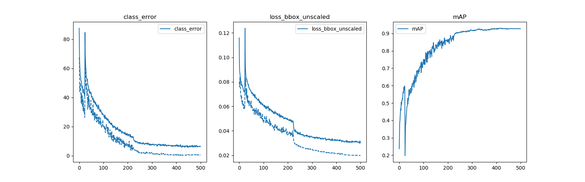

## [DETR](https://github.com/facebookresearch/detr)训练自己的数据集

**徐静**


### 0.需要的环境

```shell
# python >= 3.5
cython
submitit
torch>=1.4.0
torchvision>=0.5.0
scipy
onnx
onnxruntime
# pip3 install torch==1.4.0+cu92 torchvision==0.5.0+cu92 -f https://download.pytorch.org/whl/torch_stable.html

```


### 1.构建数据集

我们的训练数据采用COCO数据的样式( 存放在项目目录下的myData文件夹下 )

```shell
./myData
└─coco                # 数据集的名称
    ├─annotations     # 标注的json文件，coco类型的标注
      ├─instances_train.json
      ├─instances_val.json
    ├─train           # 训练图像的存放地址
      ├─xxx.jpg
    ├─val             # 验证图像的存放地址
      └─xxxx.jpg             
```

### 2.修改部分代码

**1.修改COCO的预训练的网络**

运行`./change.py`修改COCO预训练网络节点的类别数量

```shell
python3 change.py
# 在项目文件夹下生成detr_r50_{class_num}.pth
```

**2.修改`./datasets/coco.py`的build方法**

```python
def build(image_set, args):
    root = Path(args.coco_path)
    assert root.exists(), 'provided COCO path {} does not exist'.format(root)
    mode = 'instances'
    PATHS = {
        "train": (root / "train", root / "annotations" / '{}_train.json'.format(mode)),
        "val": (root / "val", root / "annotations" / '{}_val.json'.format(mode)),
    }

    img_folder, ann_file = PATHS[image_set]
    dataset = CocoDetection(str(img_folder), str(ann_file), transforms=make_coco_transforms(image_set), return_masks=args.masks)  # <----------- 如果你是python3.5 需要str(img_folder),str(ann_file)
    return dataset
```

**3.修改`./models/detr.py`中的build方法**

```python
def build(args):
    num_classes = 3+1   # <---------------类别数 这里就是不包含background的类别数，需要+1!!!
    if args.dataset_file == "coco_panoptic":  # 全景分割
        num_classes = 3+1   # <-------------
    device = torch.device(args.device)

    backbone = build_backbone(args)

    transformer = build_transformer(args)

    model = DETR(
        backbone,
        transformer,
        num_classes=num_classes,
        num_queries=args.num_queries,
        aux_loss=args.aux_loss,
    )
    if args.masks:
        model = DETRsegm(model, freeze_detr=(args.frozen_weights is not None))
    matcher = build_matcher(args)
    weight_dict = {'loss_ce': 1, 'loss_bbox': args.bbox_loss_coef}
    weight_dict['loss_giou'] = args.giou_loss_coef
    if args.masks:
        weight_dict["loss_mask"] = args.mask_loss_coef
        weight_dict["loss_dice"] = args.dice_loss_coef
    # TODO this is a hack
    if args.aux_loss:
        aux_weight_dict = {}
        for i in range(args.dec_layers - 1):
            aux_weight_dict.update({k + '_{}'.format(i): v for k, v in weight_dict.items()})
        weight_dict.update(aux_weight_dict)

    losses = ['labels', 'boxes', 'cardinality']
    if args.masks:
        losses += ["masks"]
    criterion = SetCriterion(num_classes, matcher=matcher, weight_dict=weight_dict,
                             eos_coef=args.eos_coef, losses=losses)
    criterion.to(device)
    postprocessors = {'bbox': PostProcess()}
    if args.masks:
        postprocessors['segm'] = PostProcessSegm()
        if args.dataset_file == "coco_panoptic":
            is_thing_map = {i: i <= 90 for i in range(201)}
            postprocessors["panoptic"] = PostProcessPanoptic(is_thing_map, threshold=0.85)

    return model, criterion, postprocessors
```


**4.修改main.py文件**

```python
def get_args_parser():
    parser = argparse.ArgumentParser('Set transformer detector', add_help=False)
    parser.add_argument('--lr', default=1e-4, type=float)   # <----------lr
    parser.add_argument('--lr_backbone', default=1e-5, type=float)  # <-------lr_backbone
    parser.add_argument('--batch_size', default=2, type=int)       #<---------batch size
    parser.add_argument('--weight_decay', default=1e-4, type=float)
    parser.add_argument('--epochs', default=300, type=int)         # epoch
    parser.add_argument('--lr_drop', default=200, type=int)
    parser.add_argument('--clip_max_norm', default=0.1, type=float,
                        help='gradient clipping max norm')

    # Model parameters
    parser.add_argument('--frozen_weights', type=str, default=None,
                        help="Path to the pretrained model. If set, only the mask head will be trained")
    # * Backbone
    parser.add_argument('--backbone', default='resnet50', type=str,
                        help="Name of the convolutional backbone to use")
    parser.add_argument('--dilation', action='store_true',
                        help="If true, we replace stride with dilation in the last convolutional block (DC5)")
    parser.add_argument('--position_embedding', default='sine', type=str, choices=('sine', 'learned'),
                        help="Type of positional embedding to use on top of the image features")

    # * Transformer
    parser.add_argument('--enc_layers', default=6, type=int,
                        help="Number of encoding layers in the transformer")
    parser.add_argument('--dec_layers', default=6, type=int,
                        help="Number of decoding layers in the transformer")
    parser.add_argument('--dim_feedforward', default=2048, type=int,
                        help="Intermediate size of the feedforward layers in the transformer blocks")
    parser.add_argument('--hidden_dim', default=256, type=int,
                        help="Size of the embeddings (dimension of the transformer)")
    parser.add_argument('--dropout', default=0.1, type=float,
                        help="Dropout applied in the transformer")
    parser.add_argument('--nheads', default=8, type=int,
                        help="Number of attention heads inside the transformer's attentions")
    parser.add_argument('--num_queries', default=100, type=int,   
                        help="Number of query slots")     # <-----------每张图最多预测的box个数
    parser.add_argument('--pre_norm', action='store_true')

    # * Segmentation
    parser.add_argument('--masks', action='store_true',
                        help="Train segmentation head if the flag is provided")

    # Loss
    parser.add_argument('--no_aux_loss', dest='aux_loss', action='store_false',
                        help="Disables auxiliary decoding losses (loss at each layer)")
    # * Matcher
    parser.add_argument('--set_cost_class', default=1, type=float,
                        help="Class coefficient in the matching cost")
    parser.add_argument('--set_cost_bbox', default=5, type=float,
                        help="L1 box coefficient in the matching cost")
    parser.add_argument('--set_cost_giou', default=2, type=float,
                        help="giou box coefficient in the matching cost")
    # * Loss coefficients
    parser.add_argument('--mask_loss_coef', default=1, type=float)
    parser.add_argument('--dice_loss_coef', default=1, type=float)
    parser.add_argument('--bbox_loss_coef', default=5, type=float)
    parser.add_argument('--giou_loss_coef', default=2, type=float)
    parser.add_argument('--eos_coef', default=0.1, type=float,
                        help="Relative classification weight of the no-object class")

    # dataset parameters
    parser.add_argument('--dataset_file', default='coco')
    parser.add_argument('--coco_path',default='myData/coco',type=str)   # <-----------修改default
    parser.add_argument('--coco_panoptic_path', type=str)
    parser.add_argument('--remove_difficult', action='store_true')

    parser.add_argument('--output_dir', default='',
                        help='path where to save, empty for no saving')
    parser.add_argument('--device', default='cuda',
                        help='device to use for training / testing')
    parser.add_argument('--seed', default=42, type=int)
    parser.add_argument('--resume', default='', help='resume from checkpoint')
    parser.add_argument('--start_epoch', default=0, type=int, metavar='N',
                        help='start epoch')
    parser.add_argument('--eval', action='store_true')
    parser.add_argument('--num_workers', default=2, type=int)

    # distributed training parameters
    parser.add_argument('--world_size', default=1, type=int,
                        help='number of distributed processes')
    parser.add_argument('--dist_url', default='env://', help='url used to set up distributed training')
    return parser
```

### 3.训练

```shell
python3 main.py --dataset_file "coco" --coco_path "/myData/coco" --epoch 500 --lr=1e-4 --batch_size=8 --num_workers=4 --output_dir="outputs" --resume="detr_r50_4.pth"
```

### 4.测试

```shell
# 单张图片的推断
python3 inference_img.py
```



```shell
# 视频的推断
python3 inference_video.py
```

```shell
# 将训练的log画出来
python3 ./util/plot_utils.py
```



### 5.ONNX

**TODO**